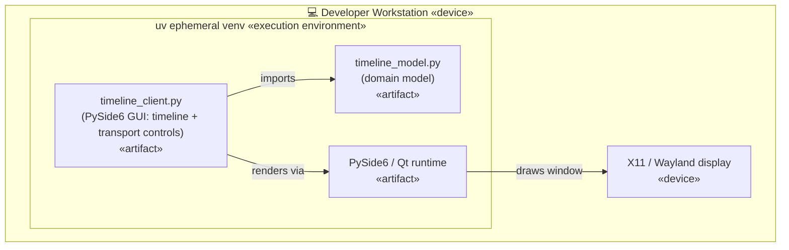

# tech-sandbox

Simple playground and example sandbox for some tech, tools and techniques.

## Requisite tools

Not every tool is needed for every workflow — see the "needed for" column.

| Tool | What for | Needed for |
| --- | --- | --- |
| [Python](https://www.python.org/) 3.11+ | Runs the client and server | everything |
| [uv](https://docs.astral.sh/uv/) | Resolves the PEP 723 inline deps and runs the scripts (no manual `pip install`) | running client/server locally |
| [entr](https://eradman.com/entrproject/) | Restarts the GUI client on source edits (`start-client.sh`) | the client live-reload script |
| [Docker](https://docs.docker.com/get-docker/) | Builds/runs the server container; also minikube's default driver | compose dev **and** minikube |
| [minikube](https://minikube.sigs.k8s.io/docs/start/) | Local single-node Kubernetes cluster | local k8s deploy |
| [kubectl](https://kubernetes.io/docs/tasks/tools/) | Applies manifests and drives the cluster | local k8s deploy |

## Current incarnation

A small PySide6 GUI showing a centered scrolling number timeline with CD-style
playback controls (back / play / stop / forward). Play advances 5 ticks per
second. A dropdown picks the sequence — `Linear`, `Primes`, or `Fibonacci` —
and each remembers its own position.


https://github.com/user-attachments/assets/0f184a50-a0fc-493b-9262-9a21439d7575


State now lives in a separate **server** process: a FastAPI/uvicorn app
(`timeline_server.py`) owns the timelines (per-sequence positions, the active
sequence, and the play/pause flag) and runs the playback clock. The GUI
(`timeline_client.py`) is a thin client that streams commands and state over one
WebSocket. State is **per client**: each client process generates a random
integer seed at startup, sends it as `?client_id=` on the WebSocket URL, and the
server keeps an independent timeline per seed — so two windows can sit on
different sequences, positions, and play/pause states at once. A single
server-side ticker drives them all, advancing only the clients currently
playing. State is keyed by seed and persists across reconnects, so a client
resumes where it left off. The client has a **Server** dropdown beside the
sequence picker for choosing which backend to connect to (only `Local` is wired
up for now; Staging/Production are stubbed in `SERVERS`).

Launch — start the server first, then one or more clients (two terminals):

```
./scripts/start-server.sh    # state server on 127.0.0.1:8000
./scripts/start-client.sh    # GUI client (run again for a second window)
```

These scripts are the stable dev interface: they hide the underlying tech so the
workflow stays the same as it evolves (e.g. when the client becomes web-based).
Both also live-reload on source edits. What they run today:

- **`start-server.sh`** → `docker compose watch`. The server runs containerized
  (FastAPI/uvicorn); on a save to `timeline_server.py` or `timeline_model.py`,
  Compose syncs the file into the running container and uvicorn's `--reload`
  watcher hot-reloads in place — no image rebuild, no container restart. Compose
  is a local dev convenience only; the image's prod `CMD` runs plain `python`
  with no reloader.
- **`start-client.sh`** → `entr -r uv run timeline_client.py`. The client is a
  self-contained renderer (it imports nothing from the model or server), so only
  its own file is watched — server/model edits don't relaunch the GUI.

The bind address comes from the `HOST`/`PORT` env vars (default `127.0.0.1:8000`
for local dev; the container sets `HOST=0.0.0.0`). `GET /healthz` is a liveness
probe for the compose healthcheck and future k8s deployment.

Dependencies are declared inline in each script (PEP 723), so `uv` installs
them into an ephemeral env on first run — no separate `pip install` step
needed.

## Present (and past) architecture

Showing the evolution of the architecture in this repo.

### (First iteration) Python script + QT, all local

A single computer runs this monolithic Python + Qt module. The two source
modules (`timeline_client.py` entrypoint and `timeline_model.py` domain model)
are installed by `uv` into an ephemeral virtual env alongside the PySide6/Qt
runtime, and drawn to the local display.



### (Second iteration) Thin GUI client + state server over WebSocket

State moves out of the GUI into a separate server process. A FastAPI/uvicorn
app (`timeline_server.py`) owns the timeline models (per-sequence positions, the
active sequence, the play/pause flag) and runs the tick loop as an asyncio
task. State is per client, keyed by the integer seed each client sends as
`?client_id=` on the WebSocket URL: the server holds one `TimelineModel` + play
flag per seed (`states: dict[int, ClientState]`), and the single ticker advances
only the seeds currently playing, pushing each its own state. The PySide6 client
(`timeline_client.py`) is a thin renderer: it sends command messages (forward /
back / play / stop / set_sequence) and redraws whatever window the server pushes
back. The two run as separate processes, and each client has its own independent
timeline.


### (Third iteration) Containerized server

The wire protocol is unchanged — same WebSocket, same client role — but the
server's *packaging and runtime* move out of a uv ephemeral venv into a Docker
container. The image (`Dockerfile`, orchestrated by `docker-compose.yml`) is
built from Astral's pinned uv base, resolves the PEP 723 inline deps **at build
time** with `uv export --script`, and installs them system-wide. So the running
container is just CPython 3.11 + FastAPI/uvicorn under a non-root user — no uv
resolution at startup. The container publishes `8000:8000` to the host, and
Docker Compose probes `GET /healthz` as a healthcheck — the same endpoint a
future Kubernetes liveness/readiness probe will use.

The Qt client stays a thin renderer, but now selects its backend via the
**Server** dropdown (`Local` today; `Staging`/`Production` stubbed), so one
client binary can target different environments. Running the server the old way
(`uv run timeline_server.py`) still works for quick local dev — the container is
the deployment-shaped path toward k8s.


### (Fourth iteration) Local kubernetes deployment via minikube

The same container is now the unit of a real Kubernetes deployment, run locally
on [minikube](https://minikube.sigs.k8s.io/) so manifests can be iterated on
quickly. `k8s/timeline-server-local.yaml` holds a `Deployment` running the
`timeline-server` image and a `Service` fronting port 8000, with liveness /
readiness probes wired to `GET /healthz` — the same endpoint the compose
healthcheck uses.

The `Deployment` is a **single replica** with a `Recreate` strategy: state is
in-memory and per-process (one ticker drives all clients), so it must never
scale past 1 — a second pod would keep its own independent state. Horizontal
scaling would need shared state first.

The desktop client is **not** containerized; it connects from the host to the
in-cluster server through a **NodePort** (fixed port `30080`). On the docker
driver the minikube IP is stable and routable from a Linux host, so the client
reaches it at `ws://<minikube-ip>:30080/ws`. WebSockets need no special config
over NodePort — it's raw TCP passthrough, so the HTTP `Upgrade` handshake passes
straight through (unlike an Ingress, which would have to be told to allow it).

**Prerequisites:** `minikube` and `kubectl` (the deploy script checks for both
and points you at their install pages if missing). Docker is the default driver.

Deploy (one command):

```
./scripts/deploy-minikube.sh
```

It starts the cluster if needed, builds the image straight into minikube
(`minikube image build` — no registry/push), applies the manifests, forces a
rollout (so a rebuilt `:latest` is actually picked up — `kubectl apply` alone
won't restart pods when the manifest text is unchanged), waits for readiness,
and prints the `ws://<minikube-ip>:30080/ws` URL. Select **Local minikube** in
the client's Server dropdown to connect. If the IP ever changes (e.g. after
`minikube delete`), update the one `Local minikube` line in `timeline_client.py`
to whatever the script prints.

Follow the logs (the k8s counterpart of `docker compose logs -f` — the server
streams client events and the full roster to stdout):

```
./scripts/logs-minikube.sh
```

A follow is bound to one pod, so a redeploy (which rolls the pod) ends the
stream — just run it again once the new pod is ready. To inspect the last
terminated pod instead: `kubectl logs deployment/timeline-server --previous`.

Teardown:

```
kubectl delete -f k8s/timeline-server-local.yaml   # remove the app, keep the cluster
minikube stop                                # stop the cluster, keep its state
minikube delete                              # nuke the cluster entirely
```


### (Next) Remote kubernetes deployments of server

Not built yet. Once the local minikube path is solid, run remote instances in
both GitHub (free?) and UpCloud (paid use). The manifests in `k8s/` are the
starting point; remote clusters will add an Ingress + TLS and real hostnames
(the stubbed `Remote Github` / `Remote UpCloud` entries in the client's
`SERVERS` dict are placeholders for those).
