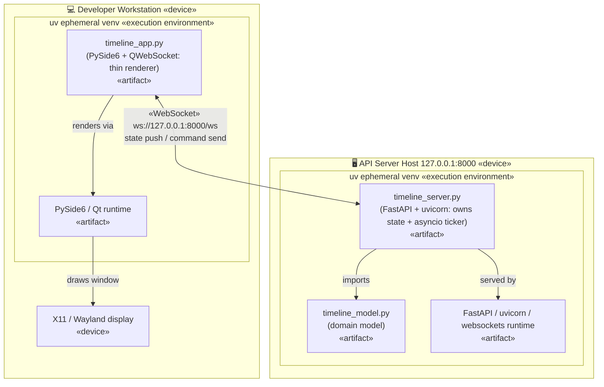

# tech-sandbox

Simple playground and example sandbox for some tech, tools and techniques.

## Current incarnation

A small PySide6 GUI showing a centered scrolling number timeline with CD-style
playback controls (back / play / stop / forward). Play advances 5 ticks per
second. A dropdown picks the sequence — `Linear`, `Primes`, or `Fibonacci` —
and each remembers its own position.

State now lives in a separate **server** process: a FastAPI/uvicorn app
(`timeline_server.py`) owns the timeline (per-sequence positions, the active
sequence, and the play/pause flag) and runs the playback clock. The GUI
(`timeline_app.py`) is a thin client that streams commands and state over one
WebSocket — so multiple GUI clients stay in sync.

Launch — start the server first, then one or more clients (two terminals):

```
uv run timeline_server.py    # state server on 127.0.0.1:8000
uv run timeline_app.py       # GUI client (run again for a second window)
```

Launch the client with filewatch/"live reload" once code changes:

```
ls *.py | entr -r uv run timeline_app.py
```

Dependencies are declared inline in each script (PEP 723), so `uv` installs
them into an ephemeral env on first run — no separate `pip install` step
needed.

## Present (and past) architecture

Showing the evolution of the architecture in this repo.

### Python script + QT, all local

A single computer runs this monolithic Python + Qt module. The two source
modules (`timeline_app.py` entrypoint and `timeline_model.py` domain model)
are installed by `uv` into an ephemeral virtual env alongside the PySide6/Qt
runtime, and drawn to the local display.


### (Current) Thin GUI client + state server over WebSocket

State moves out of the GUI into a separate server process. A FastAPI/uvicorn
app (`timeline_server.py`) owns the timeline model (per-sequence positions, the
active sequence, the play/pause flag) and runs the tick loop as an asyncio
task, broadcasting state to every connected client over a WebSocket. The
PySide6 client (`timeline_app.py`) is a thin renderer: it sends command
messages (forward / back / play / stop / set_sequence) and redraws whatever
window the server pushes back. The two run as separate processes, so multiple
clients stay in sync.


