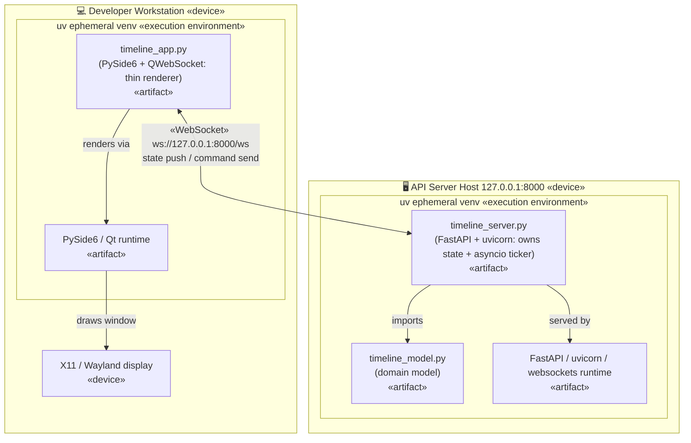
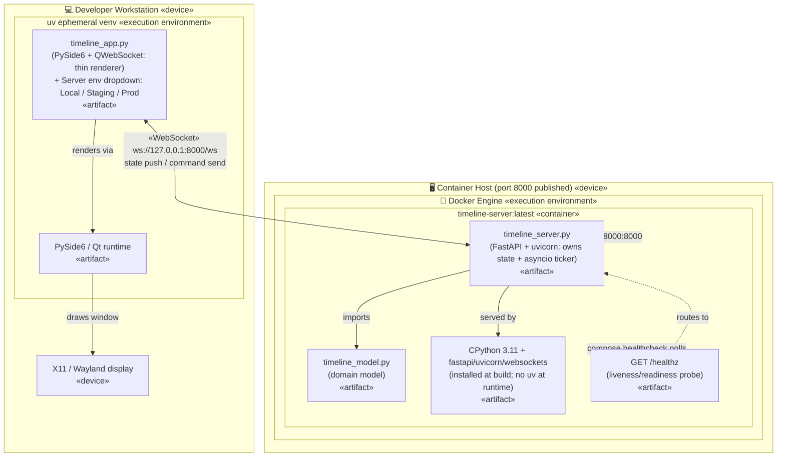

# tech-sandbox

Simple playground and example sandbox for some tech, tools and techniques.

## Current incarnation

A small PySide6 GUI showing a centered scrolling number timeline with CD-style
playback controls (back / play / stop / forward). Play advances 5 ticks per
second. A dropdown picks the sequence — `Linear`, `Primes`, or `Fibonacci` —
and each remembers its own position.

State now lives in a separate **server** process: a FastAPI/uvicorn app
(`timeline_server.py`) owns the timeline (per-sequence positions, the active
sequence, and the play/pause flag) and runs the playback clock. The GUI
(`timeline_app.py`) is a thin client that streams commands and state over one
WebSocket — so multiple GUI clients stay in sync. The client has a **Server**
dropdown beside the sequence picker for choosing which backend to connect to
(only `Local` is wired up for now; Staging/Production are stubbed in `SERVERS`).

Launch — start the server first, then one or more clients (two terminals):

```
uv run timeline_server.py    # state server on 127.0.0.1:8000
uv run timeline_app.py       # GUI client (run again for a second window)
```

The server is also containerized. To run it in Docker instead of `uv` (the
client still runs locally and connects on `localhost:8000`):

```
docker compose up --build    # state server on 127.0.0.1:8000
```

The bind address comes from the `HOST`/`PORT` env vars (default `127.0.0.1:8000`
for local dev; the container sets `HOST=0.0.0.0`). `GET /healthz` is a liveness
probe for the compose healthcheck and future k8s deployment.

Launch the client with filewatch/"live reload" once code changes:

```
ls *.py | entr -r uv run timeline_app.py
```

Dependencies are declared inline in each script (PEP 723), so `uv` installs
them into an ephemeral env on first run — no separate `pip install` step
needed.

## Present (and past) architecture

Showing the evolution of the architecture in this repo.

### (Previous) Python script + QT, all local

A single computer runs this monolithic Python + Qt module. The two source
modules (`timeline_app.py` entrypoint and `timeline_model.py` domain model)
are installed by `uv` into an ephemeral virtual env alongside the PySide6/Qt
runtime, and drawn to the local display.


### (Previous) Thin GUI client + state server over WebSocket

State moves out of the GUI into a separate server process. A FastAPI/uvicorn
app (`timeline_server.py`) owns the timeline model (per-sequence positions, the
active sequence, the play/pause flag) and runs the tick loop as an asyncio
task, broadcasting state to every connected client over a WebSocket. The
PySide6 client (`timeline_app.py`) is a thin renderer: it sends command
messages (forward / back / play / stop / set_sequence) and redraws whatever
window the server pushes back. The two run as separate processes, so multiple
clients stay in sync.



### (Current) Containerized server

The wire protocol is unchanged — same WebSocket, same client role — but the
server's *packaging and runtime* move out of a uv ephemeral venv into a Docker
container. The image (`Dockerfile`, orchestrated by `docker-compose.yml`) is
built from Astral's pinned uv base, resolves the PEP 723 inline deps **at build
time** with `uv export --script`, and installs them system-wide. So the running
container is just CPython 3.11 + FastAPI/uvicorn under a non-root user — no uv
resolution at startup. The container publishes `8000:8000` to the host, and
Docker Compose probes `GET /healthz` as a healthcheck — the same endpoint a
future Kubernetes liveness/readiness probe will use.

The Qt client stays a thin renderer, but now selects its backend via the
**Server** dropdown (`Local` today; `Staging`/`Production` stubbed), so one
client binary can target different environments. Running the server the old way
(`uv run timeline_server.py`) still works for quick local dev — the container is
the deployment-shaped path toward k8s.



### (Next) Kubernetes

Not built yet. The container is the unit of deployment: a `Deployment` running
the `timeline-server` image, a `Service` fronting port 8000, and liveness /
readiness probes wired to `GET /healthz`. Multi-client sync already holds across
WebSocket connections, so a single replica is the natural starting point (the
in-memory state is per-process, so horizontal scaling would need shared state
first).