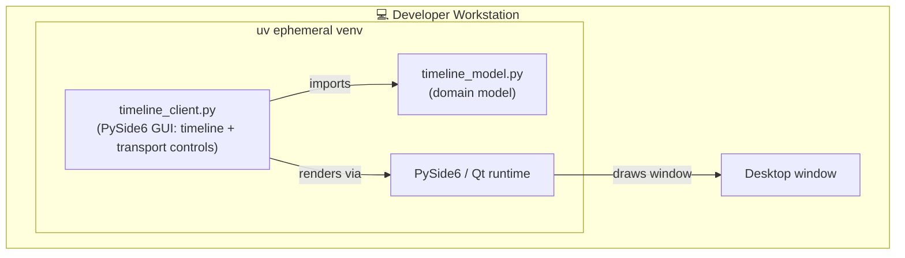
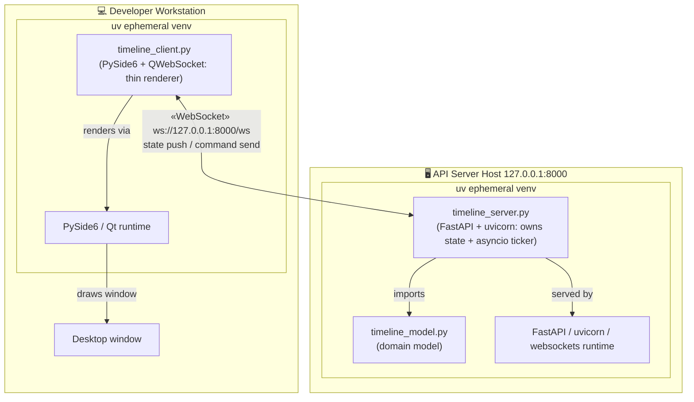
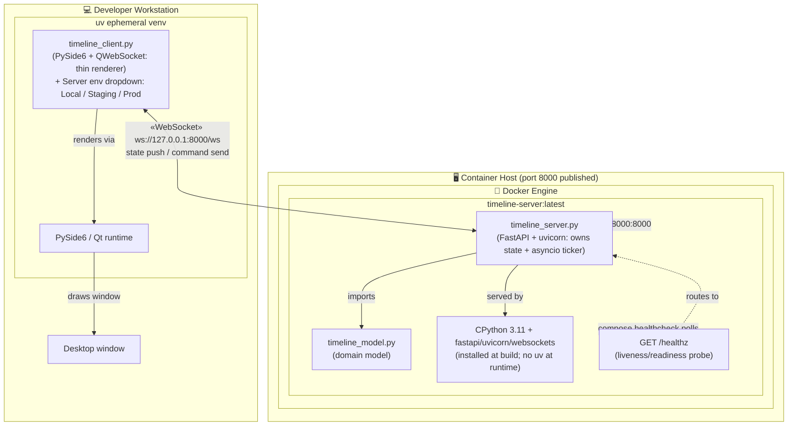
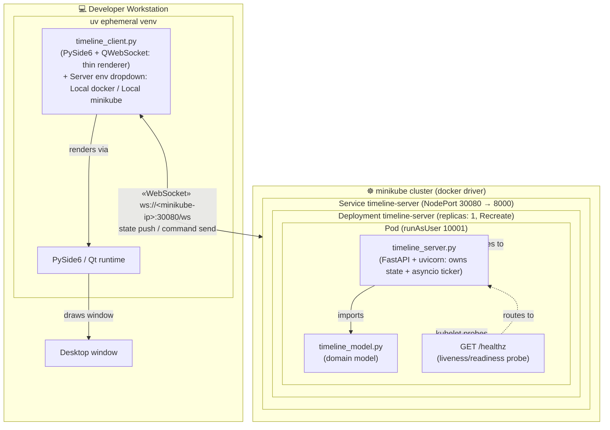
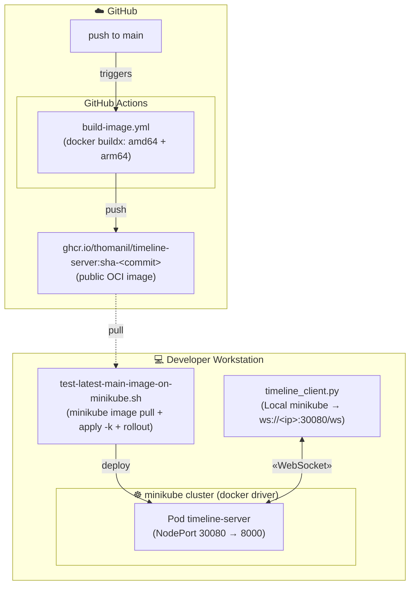
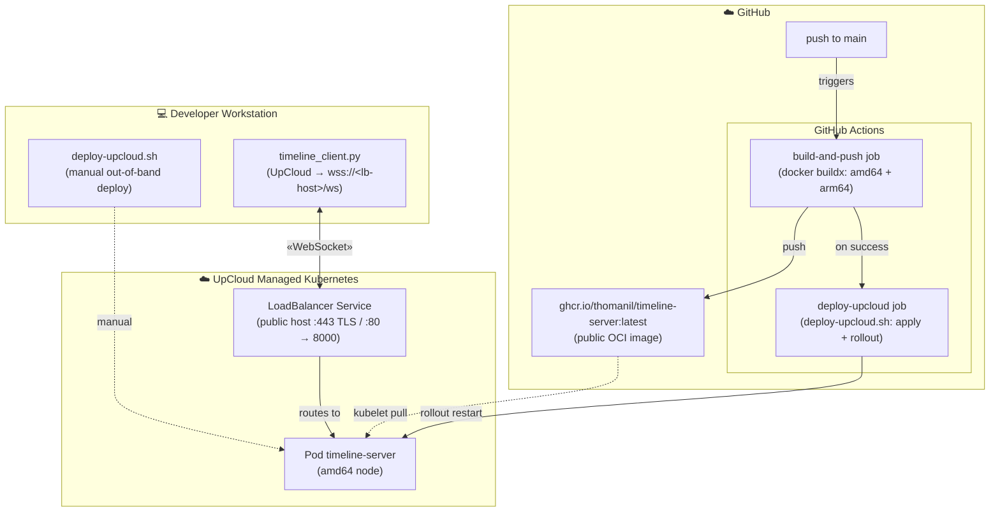
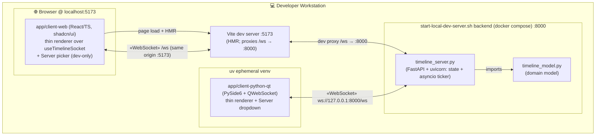
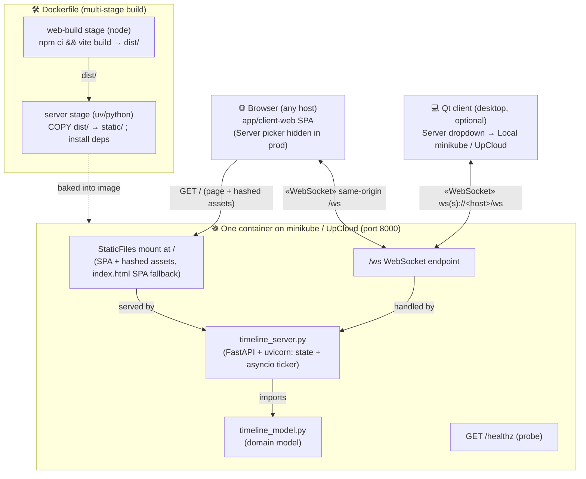
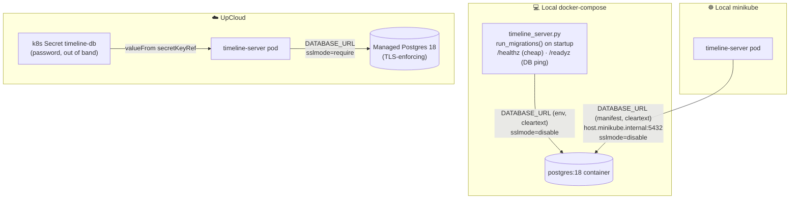
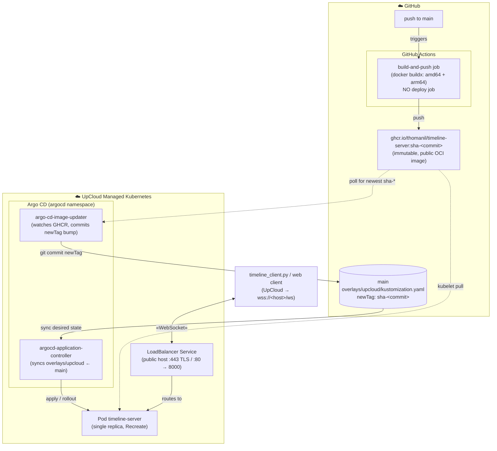

# tech-sandbox

Simple playground and example sandbox for some tech, tools and techniques.

## Requisite tools

Not every tool is needed for every workflow — see the "needed for" column.

| Tool | What for                                                                                                    | Needed for |
| --- |-------------------------------------------------------------------------------------------------------------| --- |
| [Python](https://www.python.org/) 3.11+ | Runs the client and server                                                                                  | everything |
| [uv](https://docs.astral.sh/uv/) | Resolves the PEP 723 inline deps and runs the scripts (no manual `pip install`)                             | running client/server locally |
| [Node.js](https://nodejs.org/) 22 + npm (e.g. via [nvm](https://github.com/nvm-sh/nvm)) | The Vite web ui dev + build ops (`npm`/`tsc`/`eslint`); matches the `node:22` build stage in the Dockerfile | web client dev **and** `error_check.sh`/`autofix_lint_formatting.sh` |
| [entr](https://eradman.com/entrproject/) | Restarts the Python client on source edits (`start-python-client.sh`)                                       | the client live-reload script |
| [Docker](https://docs.docker.com/get-docker/) | Builds/runs the server container; also minikube's default driver                                            | compose dev **and** minikube |
| [minikube](https://minikube.sigs.k8s.io/docs/start/) | Local single-node Kubernetes cluster                                                                        | local k8s deploy |
| [kubectl](https://kubernetes.io/docs/tasks/tools/) | Applies manifests and drives the cluster                                                                    | local k8s deploy |

## Current incarnation

A small PySide6 GUI showing a centered scrolling number timeline with CD-style
playback controls (back / play / stop / forward). Play advances 5 ticks per
second. A dropdown picks the sequence — `Linear`, `Primes`, or `Fibonacci` —
and each sequence remembers your own position.

_Started with local python script – state and everything in single script:_

https://github.com/user-attachments/assets/0f184a50-a0fc-493b-9262-9a21439d7575

_After a few iterations we had a separate observable server that handles state concurrent multiple client sessions:_

https://github.com/user-attachments/assets/0e8a17b8-b236-47f1-a588-66745e5aa157

_In the final iteration (for now) we have a public api + hosted webapp client both being hosted from a kubernetes service behind a public web url – with each clients timeline state persisted in db serverside to survive kubernetes rollouts/restarts:_

https://github.com/user-attachments/assets/cf995f77-71ce-4fcc-b31b-7cdfcdd83d69

State lives in a separate **server** process: a FastAPI/uvicorn app
(`timeline_server.py`) owns the timelines (per-sequence positions, the active
sequence, and the play/pause flag) and runs the playback clock.

The GUI is a thin client that streams commands and state over one
WebSocket. State is **per client**: each client process generates a random
integer seed at startup, sends it as `?client_id=` on the WebSocket URL, and the
server keeps an independent timeline per seed — so two windows can sit on
different sequences, positions, and play/pause states at once.

A single server-side ticker drives them all, advancing only the clients currently
playing. State is keyed by seed and persists across reconnects, so a client
resumes where it left off.

Launch locally — start the server first, then a web or python client:

```
./scripts/start-local-dev-server.sh        # python server on 127.0.0.1:8000
./scripts/start-python-client.sh           # Qt GUI client (run again for a second window)
./scripts/start-local-dev-web-client.sh    # Vite/React web client w/ HMR on http://localhost:5173
```

These scripts are the stable dev interface: they hide the underlying tech so the
workflow stays the same as it evolves. They all live-reload on source edits.
What they run today:

- **`start-local-dev-server.sh`** → `docker compose watch`. The server runs containerized
  (FastAPI/uvicorn); on a save to `app/server-python/timeline_server.py` or
  `app/server-python/timeline_model.py`,
  Compose syncs the file into the running container and uvicorn's `--reload`
  watcher hot-reloads in place — no image rebuild, no container restart. Compose
  is a local dev convenience only; the image's prod `CMD` runs plain `python`
  with no reloader.
- **`start-python-client.sh`** → `entr -r uv run app/client-python-qt/timeline_client.py`. The client is a
  self-contained renderer (it imports nothing from the model or server), so only
  its own file is watched — server/model edits don't relaunch the GUI.
- **`start-local-dev-web-client.sh`** → `npm run dev` (Vite) in `app/client-web`. Serves the
  React/TS web client on `http://localhost:5173` with hot-module reload, and
  proxies `/ws` to the backend on `:8000` (see `vite.config.ts`) so it talks to a
  `start-local-dev-server.sh` backend on the same origin. This dev server is local-only;
  the shipped path is a production `vite build` baked into the server image and
  served by the server itself (see below).

The bind address comes from the `HOST`/`PORT` env vars (default `127.0.0.1:8000`
for local dev; the docker container sets `HOST=0.0.0.0`). `GET /healthz` is a liveness
probe for the compose healthcheck and future k8s deployment.

## Quality checks

Static guardrails covering both halves of the codebase:

```
./scripts/error_check.sh                # read-only: report problems, exit non-zero on any failure
./scripts/autofix_lint_formatting.sh    # apply the fixable lint/formatting subset in place
```

- **`error_check.sh`** type-checks (`tsc -b`) and lints (`eslint .`) the web
  client, and for Python compiles every module (`py_compile`, catches
  syntax/AST errors) then lints + checks formatting via `ruff` (run through
  `uvx`, nothing to pre-install). All checks run even if one fails, so you see
  everything in one pass. It never edits files.
- **`autofix_lint_formatting.sh`** is the write counterpart: `eslint --fix`,
  `ruff check --fix` (safe fixes only), and `ruff format`. Type errors and
  unsafe lint hits still need a human; re-run `error_check.sh` to confirm.

A **pre-push hook** (`.githooks/pre-push`) runs `error_check.sh` so a broken
push never reaches the remote (or the CI it triggers). The hook is
version-controlled rather than living in `.git/hooks/`; activate it once per
clone with:

```
git config core.hooksPath .githooks
```

Bypass it for a work-in-progress branch with `git push --no-verify`.

If a broken commit is pushed this way, however, it will not make its way to the public deployment
since CI runs the same error check and will not continue rollout on error.

## Present (and past) architecture

Showing the evolution of the architecture in this repo.

### (First iteration) Python script + QT, all local

A single computer runs this monolithic Python + Qt module. The two source
modules (`timeline_client.py` entrypoint and `timeline_model.py` domain model)
are installed by `uv` into an ephemeral virtual env alongside the PySide6/Qt
runtime, and drawn to the local display.



### (Second iteration) Thin GUI client + state server over WebSocket

State moves out of the GUI into a separate server process. A FastAPI/uvicorn
app (`timeline_server.py`) owns the timeline models (per-sequence positions, the
active sequence, the play/pause flag) and runs the tick loop as an asyncio
task. State is per client, keyed by the integer seed each client sends as
`?client_id=` on the WebSocket URL: the server holds one `TimelineModel` + play
flag per seed (`states: dict[int, ClientState]`), and the single ticker advances
only the seeds currently playing, pushing each its own state. The PySide6 client
(`timeline_client.py`) is a thin renderer: it sends command messages (forward /
back / play / stop / set_sequence) and redraws whatever window the server pushes
back. The two run as separate processes, and each client has its own independent
timeline.



### (Third iteration) Containerized server

The wire protocol is unchanged — same WebSocket, same client role — but the
server's *packaging and runtime* move out of a uv ephemeral venv into a Docker
container. The image (`Dockerfile`, orchestrated by `docker-compose.yml`) is
built from Astral's pinned uv base, resolves the PEP 723 inline deps **at build
time** with `uv export --script`, and installs them system-wide. So the running
container is just CPython 3.11 + FastAPI/uvicorn under a non-root user — no uv
resolution at startup. The container publishes `8000:8000` to the host, and
Docker Compose probes `GET /healthz` as a healthcheck — the same endpoint a
future Kubernetes liveness/readiness probe will use.

The Qt client stays a thin renderer, but now selects its backend via the
**Server** dropdown (`Local` today; `Staging`/`Production` stubbed), so one
client binary can target different environments. Running the server the old way
(`uv run app/server-python/timeline_server.py`) still works for quick local dev — the container is
the deployment-shaped path toward k8s.



### (Fourth iteration) Local kubernetes deployment via minikube

The same container is now the unit of a real Kubernetes deployment, run locally
on [minikube](https://minikube.sigs.k8s.io/) so manifests can be iterated on
quickly. The `k8s/timeline-server/overlays/local` Kustomize overlay (over the
shared `k8s/timeline-server/base`) holds a `Deployment` running the
`timeline-server` image and a `Service` fronting port 8000, with liveness /
readiness probes wired to `GET /healthz` — the same endpoint the compose
healthcheck uses. (The Kustomize base/overlays split itself arrives in the
ninth iteration; early on this was a single flat `k8s/timeline-server-local.yaml`.)

The `Deployment` is a **single replica** with a `Recreate` strategy: state is
in-memory and per-process (one ticker drives all clients), so it must never
scale past 1 — a second pod would keep its own independent state. Horizontal
scaling would need shared state first.

The desktop client is **not** containerized; it connects from the host to the
in-cluster server through a **NodePort** (fixed port `30080`). On the docker
driver the minikube IP is stable and routable from a Linux host, so the client
reaches it at `ws://<minikube-ip>:30080/ws`. WebSockets need no special config
over NodePort — it's raw TCP passthrough, so the HTTP `Upgrade` handshake passes
straight through (unlike an Ingress, which would have to be told to allow it).

**Prerequisites:** `minikube` and `kubectl` (the deploy script checks for both
and points you at their install pages if missing). Docker is the default driver.

Deploy (one command):

```
./scripts/deploy-minikube.sh
```

It starts the cluster if needed, builds the image straight into minikube
(`minikube image build` — no registry/push), applies the manifests, forces a
rollout (so a rebuilt `:latest` is actually picked up — `kubectl apply` alone
won't restart pods when the manifest text is unchanged), waits for readiness,
and prints the `ws://<minikube-ip>:30080/ws` URL. Select **Local minikube** in
the client's Server dropdown to connect. If the IP ever changes (e.g. after
`minikube delete`), update the one `Local minikube` line in `app/client-python-qt/timeline_client.py`
to whatever the script prints.

Follow the logs (the k8s counterpart of `docker compose logs -f` — the server
streams client events and the full roster to stdout):

```
./scripts/logs-minikube.sh
```

A follow is bound to one pod, so a redeploy (which rolls the pod) ends the
stream — just run it again once the new pod is ready. To inspect the last
terminated pod instead: `kubectl logs deployment/timeline-server --previous`.

Teardown:

```
kubectl delete -k k8s/timeline-server/overlays/local   # remove the app, keep the cluster
minikube stop                                # stop the cluster, keep its state
minikube delete                              # nuke the cluster entirely
```



### (Fifth iteration) CI-built image on GHCR, pulled into local minikube

Until now the image only ever existed on one machine — `deploy-minikube.sh`
builds it straight into minikube from the working tree. This iteration publishes
it. A GitHub Actions workflow (`.github/workflows/build-image.yml`) builds the
server image on every push to `main` (that touches the server, Dockerfile, or
`.dockerignore`) and pushes a **multi-arch** (`amd64` + `arm64`) image to GitHub
Container Registry as `ghcr.io/thomanil/timeline-server`, tagged with an
immutable `sha-<commit>` (the long git SHA — there is no mutable `:latest`; see
the ninth iteration for why). The build uses the same `Dockerfile`, so CI and
local produce the same artifact — CI just shares it.

A new script pulls that published image back down and runs it on minikube, as an
end-to-end test of the real artifact (not local source):

```
./scripts/test-latest-main-image-on-minikube.sh
```

It resolves a commit to test (the tip of `origin/main` by default, or a git
ref/SHA you pass as `$1`), pre-pulls that `ghcr.io/thomanil/timeline-server:sha-<commit>`
into minikube (failing fast with a clear message if that build is missing or the
package is private), renders the `k8s/timeline-server/overlays/published` overlay
with the image pinned to that SHA, forces a rollout, waits for readiness, and
prints the same `ws://<minikube-ip>:30080/ws` URL. The published overlay reuses
the same `Deployment`/`Service` names and NodePort as the local one — only the
`image` (GHCR instead of the locally-built `timeline-server:latest`) and
`imagePullPolicy` (`IfNotPresent`, since the script pre-pulls) differ — so the
client's **Local minikube** dropdown entry works unchanged for either path.



### (Sixth iteration) Public remote deployment on UpCloud

With the image published to GHCR and pull-tested on minikube (above), this
iteration runs it for real: a public deployment on **UpCloud Managed
Kubernetes**, pulling the exact same image CI builds on every push to `main`.
Nothing is built or pushed from a developer machine — UpCloud pulls the published
artifact straight from GHCR (it can, because the package is public), so `main` is
the single source of truth for what runs remotely.

This iteration deployed via **push**: a `./scripts/deploy-upcloud.sh` that ran
`kubectl apply` + a forced rollout, fired automatically by a `deploy-upcloud` CI
job on every merge to `main` (and runnable by hand). **The ninth iteration
replaces this with pull-based GitOps** — that script and CI job have since been
removed, so the mechanism below is the historical push snapshot; the infra it
stands up (LB, TLS, single replica) is unchanged. The `Service` is a
`LoadBalancer` with a stable public hostname, TLS terminated at the LB on a custom
domain (`wss://tknilsson-sandbox.com/ws`), single-replica/`Recreate` like the
minikube siblings. Each rollout restarts the single in-memory-stateful pod, so
clients drop and state resets on every deployed push.

To bounce the running pod without pushing a new image — to clear in-memory state,
pick up a Secret/ConfigMap change, or recover a wedged pod — use
`./scripts/upcloud-restart-pods.sh` (a `kubectl rollout restart`, same brief
state-resetting interruption as a deploy). Follow its logs with
`./scripts/logs-upcloud.sh`.

Detail lives in [`docs/`](docs/) ([map](docs/README.md)):

- **[`upcloud-deployment.md`](docs/upcloud-deployment.md)** — kubeconfig handling,
  manifest/overlay differences, and how deployment works (now GitOps/pull — see
  the ninth iteration).
- **[`upcloud-create-cluster.md`](docs/upcloud-create-cluster.md)** — standing up or
  recreating the ephemeral cluster from scratch.
- **[`upcloud-custom-domain-tls.md`](docs/upcloud-custom-domain-tls.md)** — the custom
  domain + HTTPS/WSS cert (and the CCM gotcha behind it).


### (Seventh iteration) Vite + React + TypeScript web client, served by the same node

A second client lives in `app/client-web` (Vite + React + TypeScript, UI built
with [shadcn/ui](https://ui.shadcn.com) + Tailwind v4). It mirrors the Qt client
feature-for-feature.

It is served by the **same** server process — and so the same minikube/UpCloud
node and k8s Service — that owns `/ws`, with no second service and no CORS. The
Server-environment picker is shown only in local dev, where the Vite dev server
is a separate origin; in the shipped build the backend is fixed to the serving
origin, so the picker is hidden — gated on `import.meta.env.DEV` (see
`servers.ts` / `TimelinePlayer.tsx`).

- **Local dev** runs the two halves as separate hot-reloading processes:
  `start-local-dev-server.sh` (backend on `:8000`) and `start-local-dev-web-client.sh` (Vite dev
  server on `:5173`, proxying `/ws` → `:8000`). Edit-and-see is instant on both.
- **Shipped build** collapses them onto one origin. The Dockerfile's first stage
  (`web-build`) runs `npm ci && vite build`, then the server stage copies the
  resulting `dist/` to `app/server-python/static/`. `timeline_server.py` mounts
  that dir at `/` (with an `index.html` SPA fallback for deep links). The hashed
  `assets/` and the page load from the same host the WebSocket connects back to,
  so the one image works unchanged on localhost, the minikube NodePort, and the
  UpCloud load balancer.

So there are now two architectural shapes depending on how it's run. **In local
dev** the page and the backend are two origins, bridged by Vite's `/ws` proxy:



**In the shipped image** the two stages of the Dockerfile bake the web build into
the server, which then serves the SPA and `/ws` from one origin (single url+port) — so the web client
talks back to exactly the host it loaded from, on minikube or UpCloud alike:



The Qt client (`app/client-python-qt`) still works and targets the same backend;
the web client is an additional front end, not yet a replacement.


### (Eighth iteration) Database persistence base case

Wire the server to Postgres **transparently** and persist client state across
restarts. On startup the server process applies any pending db migrations and
loads each client's saved model, then mirrors that state
back on every change. So a client reconnecting after a redeploy resumes where it left
off. The in-memory state stays the source of truth at runtime, so the
single-replica/`Recreate` rules are unchanged — Postgres is its durable mirror, not a
shared live store.

Run it locally — the dev server script now brings up Postgres too, and you'll see
`MIGRATIONS: done …` in the logs:

```
./scripts/start-local-dev-server.sh   # now also starts a postgres:18 container
```

Full details — the transparent `DATABASE_URL` model across the three environments,
the psycopg 3 driver choice, startup migrations, and the split `/healthz`
(liveness) / `/readyz` (readiness, DB-aware) probes — are in
[`docs/database.md`](docs/database.md) (with the managed-DB specifics in
[`docs/upcloud-postgres.md`](docs/upcloud-postgres.md) and migration conventions +
locking in [`app/server-python/db/migrations/README.md`](app/server-python/db/migrations/README.md)).



### (Ninth iteration) GitOps: pull-based deploys with Argo CD + Kustomize

The sixth iteration deployed by **push** — CI ran `deploy-upcloud.sh`, which
`kubectl apply`ed a manifest and forced a rollout. That works, but it means CI
holds cluster-admin credentials, the cluster's actual state is whatever the last
`apply` happened to do, and "what's running" lives only in the cluster. This
iteration inverts it to **pull**: the cluster continuously reconciles itself to
Git, and CI never touches it.

Two pieces make that happen:

- **Kustomize base + overlays.** The three flat `k8s/timeline-server-*.yaml`
  files are refactored into one `k8s/timeline-server/base` (every-environment
  invariants — single replica, `Recreate`, split `/readyz` + `/healthz` probes,
  non-root, resource floors) plus thin `overlays/{local,published,upcloud}` that
  patch only what differs (image + pull policy, the bundled local Postgres, and
  how the `Service` is exposed). Rendering an overlay reproduces exactly what the
  old flat file deployed.
- **Argo CD + Argo CD Image Updater.** Argo CD runs *in* the UpCloud cluster and
  syncs `overlays/upcloud` from `main` (an `Application` in `k8s/argocd/`, with
  `selfHeal` + `prune` so manual drift is reverted). Argo CD Image Updater watches
  GHCR for the newest immutable `sha-<commit>` build and **commits the tag bump
  into `overlays/upcloud/kustomization.yaml`**, which Argo then rolls out. So Git
  always names the live commit — the `newTag` in that overlay *is* the deployed
  version.

That's why CI now publishes **only** `sha-<commit>` tags and no `:latest`: under
GitOps the running version must be named immutably in Git, not pinned to a moving
tag. The full deploy loop on a merge to `main`:

> CI builds & pushes `ghcr.io/…:sha-<commit>` → Image Updater sees it, commits the
> `newTag` bump to `main` → Argo CD syncs the overlay → the single pod rolls.

`main` stays the single source of truth, but now the cluster *pulls* it instead of
CI *pushing* — CI's job ends at "image in GHCR", and no GitHub-held kubeconfig
deploys anything. Exposure stays the one real per-cluster difference: `local`
minikube uses NodePort 30080 (no cloud LB), `upcloud` keeps the `LoadBalancer` +
custom-domain TLS from the sixth iteration. The `timeline-db` Postgres Secret and
the TLS cert bundle remain created out of band; a new write-scoped `git-creds`
Secret in the cluster lets Image Updater commit back. Open the live Argo UI with
`./scripts/argo-web-console-upcloud.sh` (or `-local.sh`).

The remaining decisions, the exact Image Updater annotations, and the one-time
**bootstrap runbook** (install Argo CD + Image Updater, create `git-creds`, apply
the `Application`s) live in [`k8s/GITOPS_PLAN.md`](k8s/GITOPS_PLAN.md).



### Next steps

Serverside streaming: feed/consume kafka and/or time series db, make the serve as adapter/mediator between that and gui client

More interesting/concrete domain: find something fun to visualize and stream. Weather data? Public energy sector data?
When making the featureset something interesting, also add unit test suites to QA guardrails. 
Unit+api integration serverside, e2e playwright clientside. CI should run test suites.
