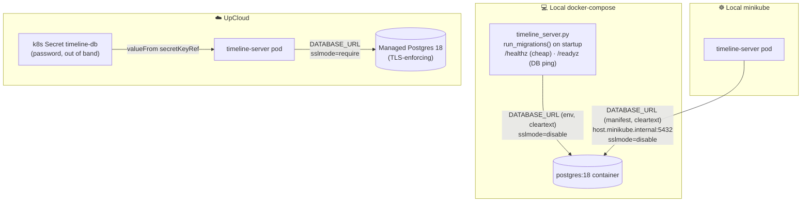

# Database & persistence

The persistence base case (README's eighth iteration): the server talks to Postgres
the **same way in every environment**, driven by a single `DATABASE_URL`. Timeline
state is still held in memory — the single-replica/`Recreate` rules are unchanged —
so what this adds is the deployment plumbing, the migration machinery, and a DB the
server connects to on startup.

> **Related:**
> - Remote managed DB: provisioning + the password Secret → [`upcloud-postgres.md`](upcloud-postgres.md).
> - Migration conventions + concurrency/locking → [`../app/server-python/db/migrations/README.md`](../app/server-python/db/migrations/README.md).

## The transparency model: one `DATABASE_URL`

The server never branches on environment. It reads a single `DATABASE_URL` env var
(a libpq connection string) and behaves identically everywhere; only the *source* of
that variable and one token inside it (`sslmode`) change:

| Environment | Source of `DATABASE_URL` | TLS |
| --- | --- | --- |
| Local docker-compose | plain `environment:` value, cleartext, in version control | `sslmode=disable` |
| Local minikube | plain `env.value` in the manifest, pointing at the compose Postgres via `host.minikube.internal:5432` | `sslmode=disable` |
| **UpCloud** | **k8s Secret `timeline-db`** (carries the password, never committed) | **`sslmode=require`** |

Unset `DATABASE_URL` means "no DB": the server still boots and skips migrations
(handy for quick `uv run app/server-python/timeline_server.py` dev). Set but
unreachable is **fatal** on startup.

Because the local Postgres is published on the host's `:5432`, the minikube pods
reach that **same** container via `host.minikube.internal` — so `docker compose up`
must be running for a minikube deploy to come up.

## Driver: psycopg 3

`psycopg[binary]` (psycopg 3) is libpq-native, so the connection string UpCloud
hands you drops in verbatim and the `sslmode` token is honored straight from the URL
— no code branch between local (`disable`) and remote (`require`). The binary wheel
means no compiler or libpq on the slim image. yoyo (below) reuses this same driver
via the `postgresql+psycopg://` scheme, so no psycopg2 is pulled in.

## Migrations on startup

On startup the server applies any pending migrations with
[yoyo-migrations](https://ollycope.com/software/yoyo/) (plain versioned SQL, no ORM
— a Flyway analogue) **before** it serves a request, so the schema is ready before
traffic. See `run_migrations()` in `../app/server-python/timeline_server.py`.

- It's **fatal**: a missing/unreachable DB or a failing migration aborts startup and
  (in k8s) CrashLoops the pod, rather than serving on a bad/half-applied schema.
- It's **loudly logged**: look for `MIGRATIONS: applying from …` →
  `MIGRATIONS: N known, M pending` → `MIGRATIONS: done (M applied); schema up to
  date`.
- The migration set starts **empty** — this iteration settles the machinery (and its
  concurrency/locking story, incl. what happens if multiple nodes migrate at once):
  [`../app/server-python/db/migrations/README.md`](../app/server-python/db/migrations/README.md).

## Health probes are split

Liveness and readiness now use different endpoints, so a DB outage degrades rather
than restart-loops:

- **`GET /healthz`** (liveness) — cheap and DB-free. A DB blip must never restart a
  healthy process.
- **`GET /readyz`** (readiness, and the compose healthcheck) — pings the DB and
  returns **503** when it's down, logging a loud `READINESS FAILED: …` line. k8s
  then pulls the pod from the load balancer (clients rejected) without killing it.

## Architecture



## Operational notes

### minikube → host Postgres needs a trailing-dot FQDN

The minikube manifests point `DATABASE_URL` at `host.minikube.internal.` — **with a
trailing dot**. That's deliberate: the pod's `resolv.conf` uses `ndots:5` plus
several search domains (including, on this dev box, a Tailscale one), so the short
name `host.minikube.internal` gets tried against every search domain first, and a
slow one adds ~6s to *every* lookup. That delay isn't bounded by `connect_timeout`
(it's DNS, before the connect), so it blows past the `/readyz` 3s probe timeout and
the pod never becomes `Ready` — the NodePort Service then has no endpoints and
clients silently can't connect (even though startup migrations and `/healthz`
succeed). The trailing dot makes the name a FQDN, so the resolver skips the search
domains and resolves in ~0ms. Don't "tidy up" the dot.

### Expected Postgres log noise on startup

The server logs a heads-up right before this happens ("MIGRATIONS: initializing yoyo
bookkeeping — any 'already exists' / 'does not exist' ERROR lines … are expected and
harmless"), so the noise is framed in context. The detail:

yoyo initializes its bookkeeping by *probing* — it runs plain statements wrapped in
`try/except` rather than using `CREATE TABLE IF NOT EXISTS`. Postgres logs the failed
statement at `ERROR` even though yoyo catches it, so two harmless lines appear on
**every** startup once the tables exist:

```
ERROR: relation "yoyo_lock" already exists           -- create_lock_table() retries CREATE, catches it
ERROR: table "yoyo_tmp_xxxxxxxxxx" does not exist     -- _check_transactional_ddl() probe (see below)
```

The second is yoyo *detecting transactional DDL*: it creates a temp table, rolls the
transaction back (Postgres DDL is transactional, so the table vanishes), then tries
to `DROP` it — the `DROP` failing with "does not exist" is exactly how it concludes
DDL rolls back cleanly. Neither line is an error in our system; the authoritative
signal is the `MIGRATIONS: done …` log line from the server. (There's no clean way to
suppress them app-side, and raising Postgres' `log_min_messages` would hide real
errors too, so they're left as-is.)
